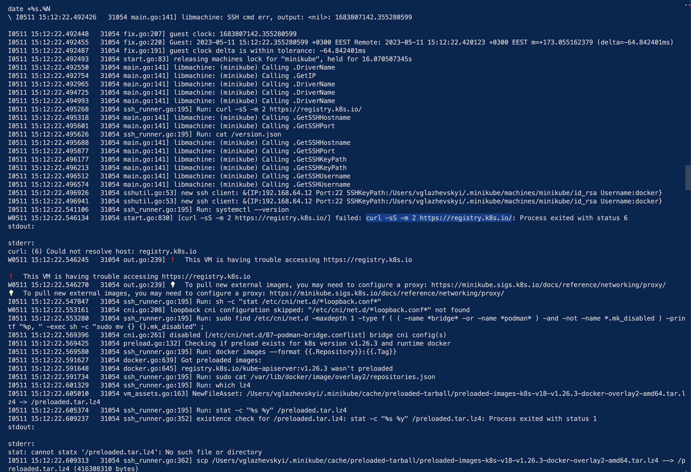

All recordings:

https://capgemini-my.sharepoint.com/personal/oleksandr_farion2_capgemini_com/_layouts/15/onedrive.aspx?id=%2Fpersonal%2Foleksandr%5Ffarion2%5Fcapgemini%5Fcom%2FDocuments%2FRecordings%201&FolderCTID=0x012000F4A2EBF91B875F4488DF85EB0E44BD1C&view=0

# Workshop 1

## Config

```bash
cat ~/.kube/config

kubectl config view
```

## Start minikube

```bash
minikube start
```

### Issue with access to k8s registry

> SOLVED: Docker Desktop should be running, or switch to use QEMU driver



❗  This VM is having trouble accessing https://registry.k8s.io

https://minikube.sigs.k8s.io/docs/handbook/vpn_and_proxy/

```bash
export HTTP_PROXY=http://<proxy hostname:port>
export HTTPS_PROXY=https://<proxy hostname:port>
export HTTPS_PROXY=localhost
export NO_PROXY=localhost,127.0.0.1,10.96.0.0/12,192.168.59.0/24,192.168.49.0/24,192.168.39.0/24
```

Some workaround here, but not help yet:
https://github.com/kubernetes/minikube/issues/7231

```bash
# --image-repository=auto
# --binary-mirror /k8s
# --image-repository=auto
minikube start --alsologtostderr -v=7
```

Maybe try to use other driver

https://minikube.sigs.k8s.io/docs/drivers/

```bash
minikube delete --all --purge
```

### Using Hyperkit

https://minikube.sigs.k8s.io/docs/drivers/hyperkit/

If Docker for Desktop is installed, you already have HyperKit

```bash
minikube start --driver=hyperkit
```

### Using VMWare driver

https://minikube.sigs.k8s.io/docs/drivers/vmware/

https://github.com/machine-drivers/docker-machine-driver-vmware

```bash
brew install docker-machine-driver-vmware
docker-machine create --driver=vmware default # not started, maybe need to install VMWare Fusion
docker-machine rm default

minikube start --driver=vmware

# In case to make it default
minikube config set driver vmware
```

Also this article can be helpful

https://medium.com/rahasak/replace-docker-desktop-with-minikube-and-hyperkit-on-macos-783ce4fb39e3

### Using QEMU

https://minikube.sigs.k8s.io/docs/drivers/qemu/

https://www.qemu.org/download/#macos

```bash
brew install qemu
minikube start --driver=qemu
minikube start --driver qemu --network builtin
minikube start --driver qemu --network builtin --alsologtostderr -v=4
```

### Stop minikube

```bash
minikube stop
minikube delete
```

## Metrics server & dashboard

### On Minikube

#### Metrics server

Won't work, see workarounds

- https://devpress.csdn.net/k8s/62fcbbcbc677032930801d04.html
- https://gist.github.com/F21/08bfc2e3592bed1e931ec40b8d2ab6f5

```bash
minikube addons list

minikube addons enable metrics-server

# --alsologtostderr -v=1 | --url=true
minikube dashboard --url=true


## http://192.168.2.22:8001/api/v1/namespaces/kubernetes-dashboard/services/http:kubernetes-dashboard:/proxy/:

minikube addons disable metrics-server
```

#### Dashboard

https://minikube.sigs.k8s.io/docs/handbook/dashboard/

```bash
minikube dashboard
```

Not working... maybe proxy

### On Docker

#### Metric server

Metrics Server collects resource metrics from kubelets and exposes them in Kubernetes apiserver through Metrics API

https://github.com/kubernetes-sigs/metrics-server

Installation:

https://github.com/kubernetes-sigs/metrics-server#installation

#### Dashboard

General Information:

https://kubernetes.io/docs/tasks/access-application-cluster/web-ui-dashboard/

Deploying the Dashboard UI:

https://kubernetes.io/docs/tasks/access-application-cluster/web-ui-dashboard/#deploying-the-dashboard-ui

Accessing the Dashboard UI:

https://kubernetes.io/docs/tasks/access-application-cluster/web-ui-dashboard/#accessing-the-dashboard-ui

https://github.com/kubernetes/dashboard/blob/master/docs/user/access-control/creating-sample-user.md

#### Prepare

You should have [k8s-dashboard-sa.yaml](./01/k8s-dashboard-sa.yaml) file

```bash
kubectl apply -f https://github.com/kubernetes-sigs/metrics-server/releases/latest/download/components.yaml

kubectl apply -f https://raw.githubusercontent.com/kubernetes/dashboard/v2.7.0/aio/deploy/recommended.yaml

# Fix issue with pre-requisites(kubelet CA requirements) 
kubectl patch deployment metrics-server --type='json' -p='[{"op": "add", "path": "/spec/template/spec/containers/0/args/5", "value": "--kubelet-insecure-tls" }]' -n kube-system

kubectl apply –f k8s-dashboard-sa.yaml
```

#### Get token, run proxy and go to dashboard

```bash
kubectl -n kubernetes-dashboard create token admin-user

# After run go to http://localhost:8001/api/v1/namespaces/kubernetes-dashboard/services/https:kubernetes-dashboard:/proxy/
kubectl proxy
```

> Select All namespaces in dropdown to see all of them

# Workshop 2

## General

https://kubernetes.io/docs/reference/generated/kubectl/kubectl-commands

- **Create** - Create a resource from a file or from stdin.
- **Apply** - Apply a configuration to a resource by filename or stdin
- **Get** - Display one or many resources
- **Expose** - Take a replication controller, service, deployment or pod and expose it as a new Kubernetes Service
- **Delete** - Delete resources by filenames, stdin, resources and names, or by resources and label selector
- **Label** - Update the labels on a resource
- **Scale** - Set a new size for a Deployment, ReplicaSet or Replication Controller

## Context

```bash
# Context
kubectl config get-contexts
kubectl config current-context
kubectl config use minicube # or docker-desktop
```

## Info

```bash
kubectl get node
kubectl get pods --all-namespaces
kubectl get deployments
kubectl get services
kubectl get events

# Log pods
kubectl logs <pod-name>
```

## Object specs

```bash
# List of resources
kubectl api-resources --namespaced=true|false

# Api versions
kubectl api-versions

# Documentation
kubectl explain pod
```

## Create / Delete pods

```bash
kubectl create -f kfb-2/dummy-pod.yaml

kubectl get pods

# Delete pod by name
kubectl delete pod dummy-pod

# It can be deleted by filename too
kubectl delete -f kfb-2/dummy-pod.yaml
```

## Deployments

```bash
kubectl apply -f kfb-2/echo-deployment.yaml
kubectl get deploy
kubectl get pods
```

## Exposing

Expose command will create ClusterIP typed service

Requests can be sent to K8S API according to following URL:

http://127.0.0.1:8001/api/v1/namespaces/<NS name>/services/<SVC name>/proxy/

```bash
kubectl expose deployment echo-deployment --port=80 --name=echo-deploy-service

kubectl get services # or svc

kubectl proxy

curl http://127.0.0.1:8001/api/v1/namespaces/default/services/echo-deploy-service/proxy/
```

## Homework

### Task 1

```bash
kubectl apply -f task1.yaml
kubectl get deploy
kubectl expose deployment task-1-deployment --port=80 --name=task-1-service
kubectl get services
kubectl proxy
```

Then, make request to the service:

```bash
curl http://127.0.0.1:8001/api/v1/namespaces/default/services/task-1-service/proxy/
```

Output:

```json
{
    "host": {
        "hostname": "kubernetes.docker.internal",
        "ip": "::ffff:10.1.0.1",
        "ips": []
    },
    "http": {
        "method": "GET",
        "baseUrl": "",
        "originalUrl": "/",
        "protocol": "http"
    },
    "request": {
        "params": {
            "0": "/"
        },
        "query": {},
        "cookies": {},
        "body": {},
        "headers": {
            "host": "kubernetes.docker.internal:6443",
            "user-agent": "curl/7.87.0",
            "accept": "*/*",
            "accept-encoding": "gzip",
            "x-forwarded-for": "127.0.0.1, 127.0.0.1",
            "x-forwarded-uri": "/api/v1/namespaces/default/services/task-1-service/proxy/"
        }
    },
    "environment": {
        "PATH": "/usr/local/sbin:/usr/local/bin:/usr/sbin:/usr/bin:/sbin:/bin",
        "HOSTNAME": "task-1-deployment-74cb67c874-khdfz",
        "password": "va0s9dv^",
        "username": "bingo",
        "USERNAME": "bingo",
        "PASSWORD": "va0s9dv^",
        "KUBERNETES_SERVICE_HOST": "10.96.0.1",
        "KUBERNETES_SERVICE_PORT": "443",
        "KUBERNETES_SERVICE_PORT_HTTPS": "443",
        "KUBERNETES_PORT": "tcp://10.96.0.1:443",
        "KUBERNETES_PORT_443_TCP": "tcp://10.96.0.1:443",
        "KUBERNETES_PORT_443_TCP_PROTO": "tcp",
        "KUBERNETES_PORT_443_TCP_PORT": "443",
        "KUBERNETES_PORT_443_TCP_ADDR": "10.96.0.1",
        "NODE_VERSION": "16.16.0",
        "YARN_VERSION": "1.22.19",
        "HOME": "/root"
    }
}
```

# Workshop 3

```bash
kubectl apply -f dep-with-pv.yaml

kubectl get deploy
kubectl get pods

kubectl expose deployment dep-with-pv --port=80 --name=dep-with-pv-service

kubectl get services

kubectl describe service dep-with-pv

kubectl get endpoints

curl http://127.0.0.1:8001/api/v1/namespaces/default/services/dep-with-pv-service/proxy/

# Cleanup

kubectl delete -f dep-with-pv.yaml

kubectl delete service dep-with-pv-service
```
